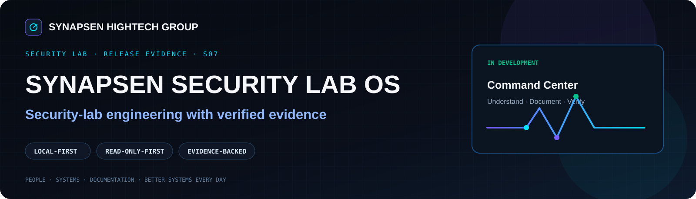

<!-- SYNAPSEN_DASHBOARD_INTRO_START -->
<p align="center"></p>

<table><tr><td width="50%" valign="top">

### Verified Evidence

`S07` · `V24T-BRANDING-R1` · `SPDX 3.0.1` · `FAIL-CLOSED VERIFIER`

Public evidence includes the release manifest, provenance, SPDX package inventory and acceptance matrix.

</td><td width="50%" valign="top">

### Maturity Boundary

**IN DEVELOPMENT**

No public ISO is claimed. No complete public source-to-ISO rebuild is claimed. Verified release-chain evidence is kept distinct from whole-product maturity.

</td></tr></table>

<!-- SYNAPSEN_DASHBOARD_INTRO_END -->

# SYNAPSEN SECURITY LAB OS

> **Public engineering snapshot — project status: `IN DEVELOPMENT`**  
> Release-chain evidence is shown separately from broader product maturity.

**SYNAPSEN SECURITY LAB OS (SSLOS)** is a Kali-based security-lab engineering
project focused on reproducible release verification, offline trust,
evidence-driven acceptance and a German-first operator experience.

This repository is published under the **Synapsen HighTech Group** independent
technical project identity. It is a portfolio/review repository, not a claim
that a staffed company, commercial product or generally available distribution
exists.

## Status model

| Label | Meaning |
|---|---|
| **VERIFIED** | Directly supported by sealed evidence in this repository or its provenance ledger |
| **PROJECT PROVEN** | Implemented and demonstrated in the project, with supporting project evidence |
| **IN DEVELOPMENT** | Active project scope that is not being represented as a finished public product |
| **CONCEPT** | Design or planned direction; not claimed as implemented |

## What is verified here

**VERIFIED — S07 release-chain engineering**

- release ID: `SYNAPSEN-SECURITY-LAB-OS-2026.3-S07`
- sealed artifact revision: `V24T-BRANDING-R1`
- artifact SHA-256: `92bd8a7cf26d011ff45e7430b741b912a32e175b132a3eee559fa4fb4a4bfc96`
- artifact size: `5,652,692,992` bytes
- runtime branding acceptance: `B01-B14 PASS`
- SPDX version: `3.0.1`
- sealed package inventory: `2,953`
- acceptance matrix: `16/16` expected outcomes
- verifier behavior: fail-closed
- release-manifest signing profile: OpenPGP Ed25519 detached signature
- 13/13 sampled release-metadata files from the large local RAR are
  SHA-256-identical to the final V24T artifact mirror

The ISO itself is **not** included in this repository.

## Engineering shown in the repository

### Offline release verifier — VERIFIED

`controller/S07/` contains the first-party release verification foundation:

- deterministic release manifest generation,
- artifact SHA-256 and size binding,
- detached OpenPGP verification,
- trusted-key identity and expiry checks,
- provenance binding,
- SPDX SBOM binding,
- M1 acceptance-seal binding,
- path-traversal protection,
- fail-closed CLI behavior,
- German-first verification view-model contract.

### SPDX 3.0.1 pipeline — VERIFIED / PROJECT PROVEN

The included first-party generator and validator implement deterministic
canonical JSON generation and project-specific SBOM contract validation.
Sealed project evidence records JSON Schema, SHACL, reproducibility and exact
package-inventory validation as PASS.

Third-party vendored Python wheels and SPDX specification assets are intentionally
not republished in this public snapshot. Their omission is documented under
`docs/DEPENDENCIES_AND_REPRODUCIBILITY.md`.

### Acceptance matrix — VERIFIED

The public matrix contains one expected valid-chain PASS case and fifteen
expected fail-closed cases covering tampering, missing evidence, untrusted or
expired/revoked keys, schema downgrade and SBOM path traversal.

## Important scope boundary

The internal S07 evidence marks its **release chain** as closed/sealed. The
broader public project is nevertheless shown here as **IN DEVELOPMENT** because
the current public snapshot does not contain the complete distribution build
workspace, every design/runtime component, or a public end-to-end source-to-ISO
rebuild path.

That distinction is intentional: a sealed release artifact is evidence of a
specific engineering milestone, not permission to overstate the maturity of
the entire project.

## Repository map

```text
controller/S07/              first-party verifier / manifest / SPDX / UI-contract source
release-metadata/S07/        safe original release metadata, signature, SBOM and package inventory
evidence/public/             public-safe evidence and provenance derivatives
docs/                        architecture, claims, security and limitations
scripts/verify_public_repo.py local repository consistency verifier
```

## Quick verification

```bash
python scripts/verify_public_repo.py
```

This verifies the public repository's internal evidence bindings. It does **not**
verify the absent ISO or perform the private full release-chain verification.

For the original full release verifier contract, see:

`controller/S07/cli/synapsen-verify-release.ps1`

## Security and privacy

No private keys, recovery-key material, credentials, private host paths, private
device serials, VM images or ISO images are included.

See `SECURITY.md` and `docs/PUBLICATION_SCOPE.md`.

## Portfolio relevance

This project demonstrates practical work around Linux/security-lab engineering,
PowerShell/Python tooling, release integrity, SBOMs, offline verification,
negative testing, evidence chains and safe publication boundaries.
